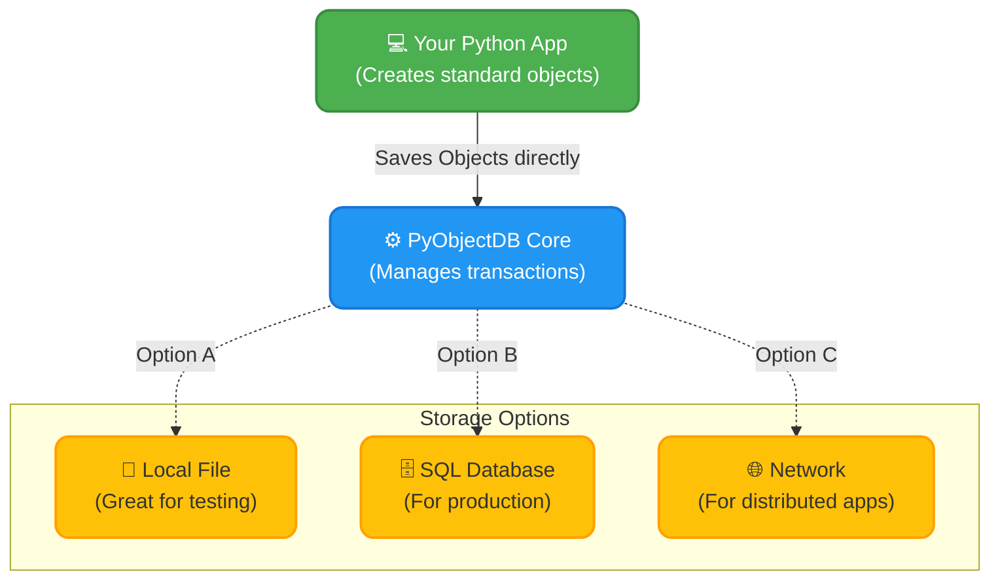

# 📦 PyObjectDB: Seamless Python Object Storage

Hi there! Welcome to **PyObjectDB**. This is a project I've been working on to solve a common headache in Python development: translating objects to relational databases. 

Instead of writing complex SQL queries or dealing with clunky Object-Relational Mappers (ORMs), **PyObjectDB** lets you store your Python objects *exactly as they are*. It’s a pure, ACID-compliant, object-oriented database designed to make your code feel incredibly clean and natural.

## 🚀 Why I Built This

I realized that we spend way too much time writing boilerplate code just to save data. With PyObjectDB, you can:
- **Skip the SQL**: You don't need to know another language just to save a Python class.
- **Forget the ORM**: There is no mapping layer. You just save the object, and it stays an object.
- **Keep it Pythonic**: The seam between your application logic and your database is practically invisible.

## 🧠 How It Works (Simplified Architecture)

Here is a simple diagram showing how your Python code interacts with the database. Notice how there is no translation layer—your objects go straight into storage!

## 🛠️ Getting Started

This database runs beautifully on Python 3.7+ and PyPy. Whether you are building a small personal project or a large distributed system, PyObjectDB adapts to your needs seamlessly.

---
*Feel free to explore the code, open issues, or submit pull requests!*
