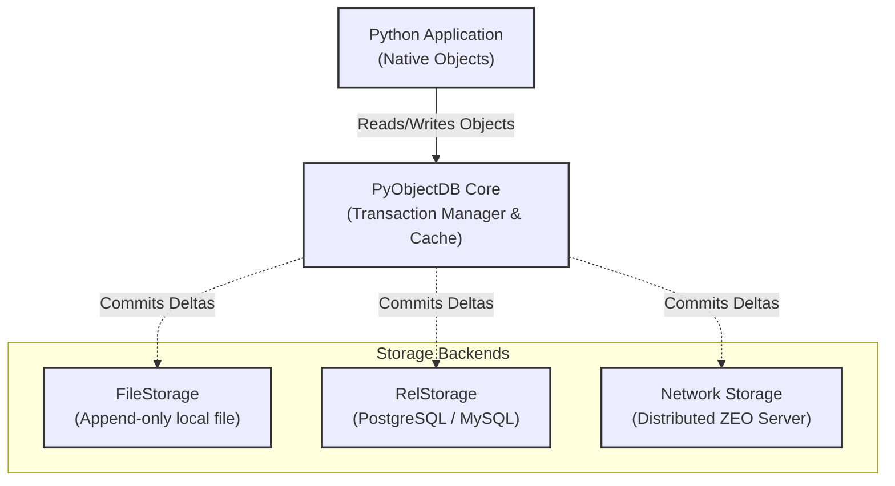

# PyObjectDB: Seamless Python Object Storage

Welcome to PyObjectDB, an ACID-compliant, object-oriented database designed natively for Python applications. 

Traditional relational databases require developers to map their application's object models into tables using an Object-Relational Mapper (ORM). PyObjectDB eliminates this translation layer entirely. It allows you to persist Python objects exactly as they are in memory, drastically simplifying your architecture and reducing boilerplate code.

## Technical Architecture

PyObjectDB operates by hooking into Python's native serialization mechanisms and tracking state changes in memory. When a transaction is committed, only the modified objects are serialized and written to the underlying storage mechanism.

## Key Technical Details

- **ACID Transactions**: Every modification is fully transactional. If an error occurs, you can roll back the transaction, and your in-memory Python objects will revert to their previous state automatically.
- **Multi-Version Concurrency Control (MVCC)**: Readers are never blocked by writers. The database maintains historical states of objects to ensure consistent reads across concurrent threads or processes.
- **Pluggable Storage Backends**: 
  - `FileStorage`: A highly optimized, append-only local file structure suitable for single-node applications.
  - `RelStorage`: Allows you to back PyObjectDB with an existing SQL database (like PostgreSQL) for enterprise-grade durability and replication.
  - `ZEO (Zope Enterprise Objects)`: A client-server architecture that lets multiple Python processes share the same PyObjectDB database over a network.
- **Transparent Persistence**: By inheriting from the `Persistent` base class, PyObjectDB automatically tracks when your object's attributes change, ensuring only modified data is sent to the database.

## Getting Started

This database runs on Python 3.7+ and PyPy. It is heavily utilized in complex web frameworks and distributed task queues where the relational model becomes a bottleneck for deep, graph-like object relationships.
