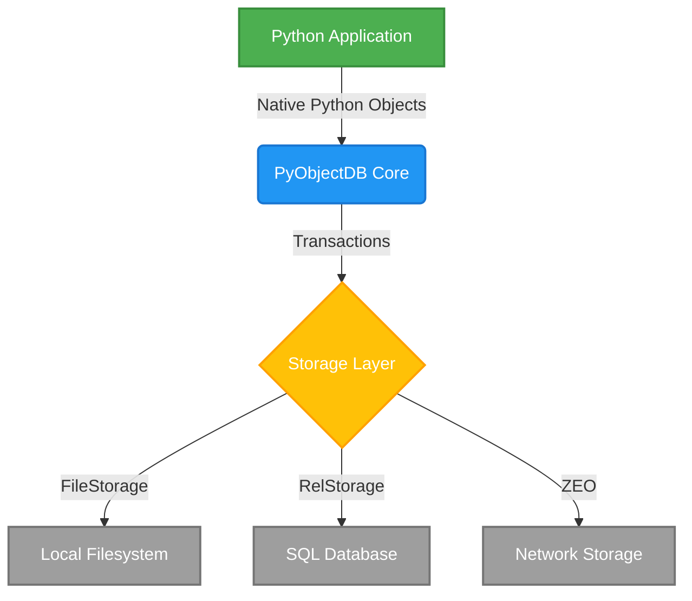

# PyObjectDB (formerly ZODB)

    

**PyObjectDB** is an ACID-compliant, object-oriented database for Python that provides a high degree of transparency. It runs on Python 3.7 and above, as well as PyPy.

## Key Features

- **No separate language** for database operations.
- **Very little impact** on your code to make objects persistent.
- **No database mapper** that partially hides the database. Using an object-relational mapping is *not* like using an object-oriented database.
- **Almost no seam** between code and database.

## Architecture

PyObjectDB natively stores Python objects without requiring an ORM layer, ensuring seamless integration between your code's state and the database's persistence.

## Documentation

To learn more, visit: https://zodb-docs.readthedocs.io

*(This repository is a renamed demonstration fork of the original ZODB project.)*
